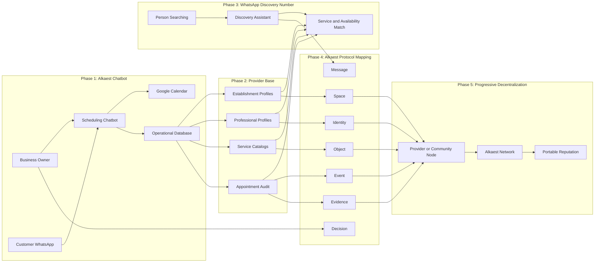

# Chatbot-to-Network Progression

## Notes

This diagram shows product progression, not a commitment that all chatbot data becomes public protocol data.

Appointment-derived records must be filtered through privacy, consent, and minimization rules before becoming network Evidence.

