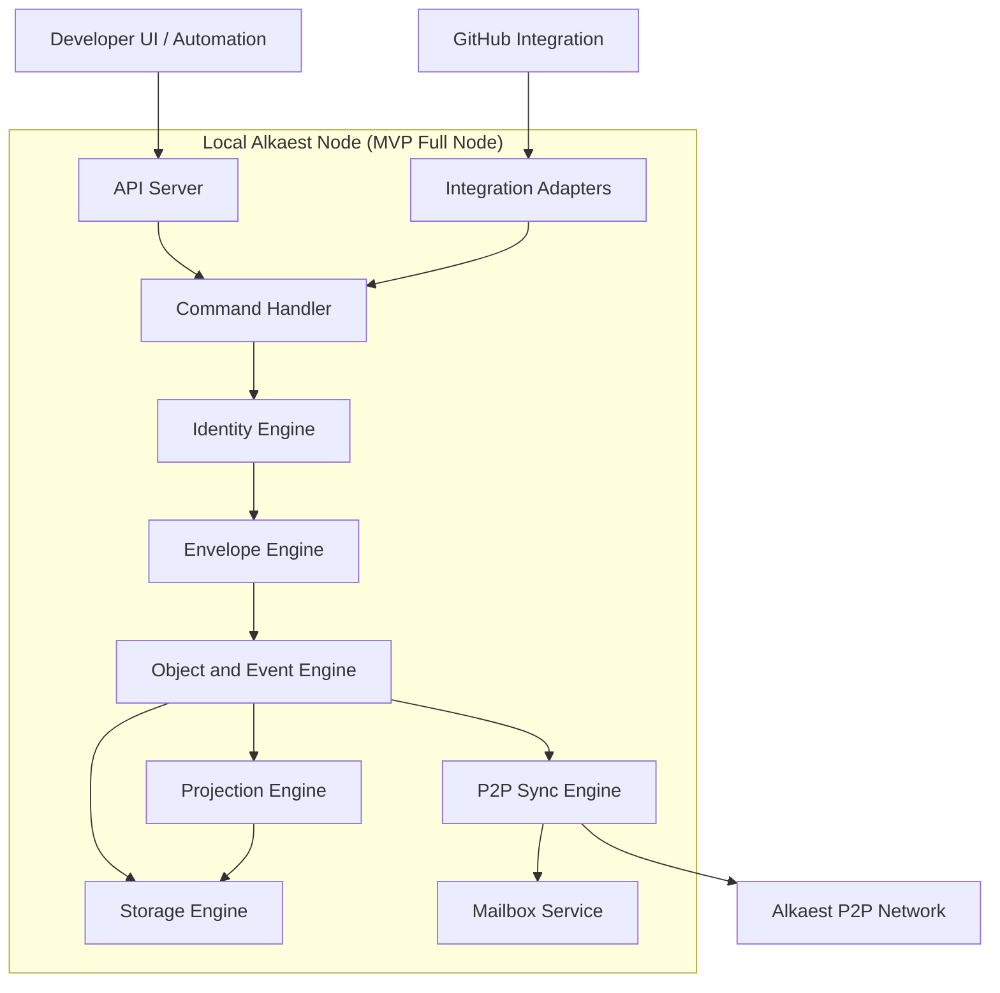

# Node Architecture

## Notes

- The MVP assumes a local full node per developer.
- GitHub is an integration input, not protocol authority.
- Light-client behavior is intentionally out of scope for this diagram.
