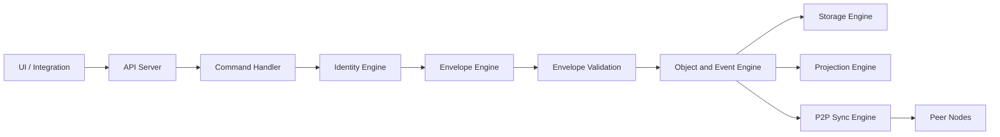

# Request Lifecycle

```mermaid
flowchart LR
    CLIENT["UI / Integration"] --> API["API Server"]
    API --> CMD["Command Handler"]
    CMD --> ID["Identity Engine"]
    ID --> ENV["Envelope Engine"]
    ENV --> VALIDATE["Envelope Validation"]
    VALIDATE --> OBJ["Object and Event Engine"]
    OBJ --> STORE["Storage Engine"]
    OBJ --> PROJ["Projection Engine"]
    OBJ --> SYNC["P2P Sync Engine"]
    SYNC --> PEERS["Peer Nodes"]
```

## Notes

- This shows the logical path for a local command becoming synchronized protocol state.
- Queries read from projections and do not bypass the runtime pipeline.
