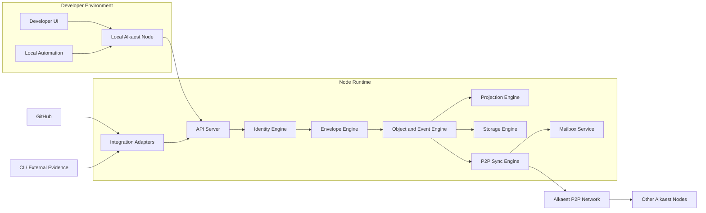

# System Overview

## Notes

- The MVP is desktop-first and assumes a local full node per developer.
- The local node is the protocol boundary for UI, automation, and integrations.
- GitHub and CI systems are inputs to the node, not protocol authorities.
- Detailed node internals are described in [node-architecture.md](/Users/nivaldojunior/Documents/Alkaest/alkaest/docs/diagrams/node-architecture.md).
