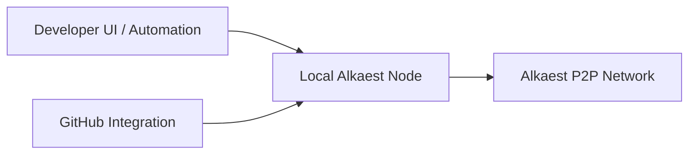
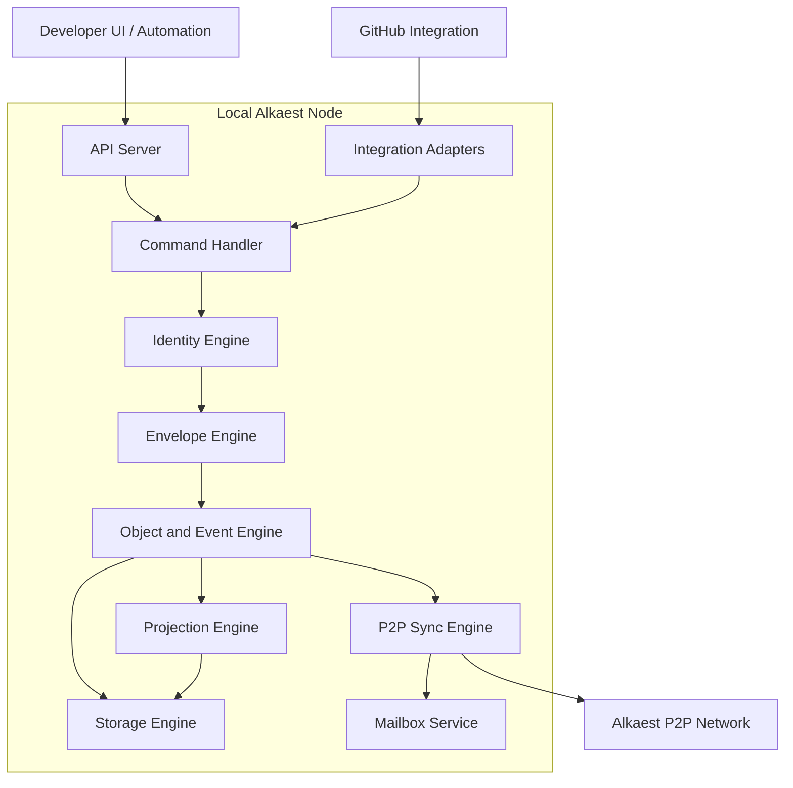
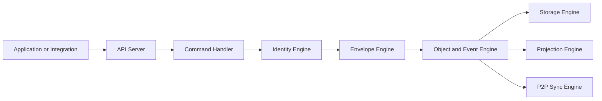

# RFC-0002 — Node Architecture

**Status:** Draft
**Author:** modern_alchemist
**Date:** 2026
**Category:** Architecture Specification

---

# 1. Abstract

This RFC defines the architecture of the **Alkaest Node** for the desktop-first MVP.

The node is the primary execution boundary of the protocol. It is responsible for:

* local identity custody
* command handling
* envelope validation
* event processing
* projection updates
* storage
* network synchronization
* integration with external tools

For the MVP, Alkaest assumes that each developer operates a **local full node**.
This RFC does not require mobile-first operation or light-client behavior.
Any reduced or embedded node profile is considered future work unless another RFC promotes it into scope.

---

# 2. Goals

This RFC defines:

* the responsibilities of a node
* the internal runtime components of a node
* the boundary between applications, integrations, and the node
* the MVP deployment model
* the lifecycle of commands entering and leaving the node

This RFC does not define:

* marketplace workflow rules
* reputation algorithms
* settlement or escrow mechanisms
* GitHub-specific workflow behavior
* light-client synchronization protocols

Those concerns belong in later RFCs.

---

# 3. Context

RFC-0001 establishes that:

* protocol logic is node-first
* applications interact through a node API
* nodes communicate through a P2P network
* state is represented through signed envelopes and events

The current project direction adds the following MVP assumptions:

* the first domain is open-source development coordination
* the MVP is desktop-first
* each developer runs a local node
* GitHub is an integration layer, not the protocol
* the first project coordinated through the network is expected to be Alkaest itself

This RFC turns those assumptions into an implementation-aware architecture.

---

# 4. MVP Node Model

## 4.1 Full node by default

In the MVP, every Alkaest participant is expected to use a **full node** running locally on their desktop or workstation.

The full node stores and processes:

* local identities and signing keys
* protocol envelopes relevant to synchronized spaces
* object and event history
* materialized query projections
* attachment references
* mailbox messages addressed to local identities

The full node also exposes a local API for user interfaces, automation, and integrations.

## 4.2 Local-first operation

The default operating model is:

Applications do not implement protocol logic directly.
They delegate protocol actions to the local node.

## 4.3 No light-client requirements in MVP

The MVP does not require:

* mobile-embedded nodes
* selective sync profiles
* partial trust replication
* remote custodial node operation

These may be introduced later, but they are not architectural requirements for the first implementation.

---

# 5. Architectural Principles

## 5.1 Node as protocol boundary

The node is the only component that:

* signs protocol actions
* validates incoming envelopes
* persists authoritative local protocol state
* publishes protocol data to peers

Applications and integrations must not bypass the node and speak protocol directly.

## 5.2 Clear separation between protocol and integration

External systems such as GitHub, CI providers, file storage, or automation tools are integrations.
They may provide inputs and evidence to the node, but they do not define protocol truth.

## 5.3 Deterministic local processing

Given the same valid envelopes, honest nodes should be able to derive the same projection state.
The node architecture must therefore separate:

* envelope acceptance
* event application
* projection generation

so that validation and replay remain explicit.

## 5.4 Local custody of user authority

For the MVP, private signing authority is expected to be controlled locally by the operator's node.
Remote signing services are not required by this RFC.

---

# 6. Node Responsibilities

An Alkaest Node MUST provide the following responsibilities.

## 6.1 Identity management

The node manages local protocol identities and the keys used to sign commands and envelopes.

Responsibilities include:

* creating local identities
* loading local identities
* selecting the active identity for a command
* signing protocol payloads
* storing local identity metadata

Detailed identity delegation rules belong in a later RFC, but the node architecture must reserve a dedicated identity subsystem.

## 6.2 Command execution

The node accepts commands from applications and integrations, validates local preconditions, and converts valid commands into signed protocol envelopes.

## 6.3 Envelope validation

The node verifies every incoming or locally created envelope before it becomes part of local protocol state.

Validation includes:

* signature verification
* payload hash verification
* protocol version checks
* schema checks
* basic object-kind checks

## 6.4 Event and object processing

The node stores accepted protocol objects and events, then updates local read models and indexes.

## 6.5 Storage

The node persists enough data to:

* reconstruct local protocol state
* answer queries
* recover after restart
* resynchronize with peers

## 6.6 P2P synchronization

The node communicates with peers to:

* discover peers
* exchange inventories
* request missing data
* publish newly accepted envelopes
* relay mailbox traffic

## 6.7 Query serving

The node exposes query interfaces for local applications and automation.
Queries operate on projections rather than mutating protocol state directly.

## 6.8 Integration execution

The node may run integration adapters that transform external events into protocol-relevant inputs.

Examples include:

* GitHub webhook processing
* repository metadata ingestion
* CI result capture
* attachment upload coordination

These adapters remain subordinate to protocol validation.

---

# 7. Internal Runtime Components

The MVP node runtime is divided into the following internal components.

## 7.1 API Server

The API Server exposes the local application boundary.

It is responsible for:

* receiving commands
* serving queries
* exposing streams or subscriptions
* authenticating local clients if configured
* mapping API requests into runtime operations

The API surface itself is defined by a later RFC.

## 7.2 Command Handler

The Command Handler receives commands from the API Server or internal integrations.

It is responsible for:

* syntactic command validation
* identity selection
* permission prechecks
* payload assembly
* forwarding to the signing and envelope pipeline

## 7.3 Identity Engine

The Identity Engine manages local identities and signing operations.

It is responsible for:

* key storage
* signing requests
* identity lookup
* local identity metadata
* future support for delegated actors

## 7.4 Envelope Engine

The Envelope Engine creates and verifies protocol envelopes.

It is responsible for:

* canonical payload preparation
* payload hashing
* envelope assembly
* signature verification
* envelope admission checks

## 7.5 Object and Event Engine

The Object and Event Engine applies accepted protocol data to the local state model.

It is responsible for:

* storing accepted objects and events
* ordering local application steps
* rejecting invalid transitions
* replay support
* publishing projection update notifications

## 7.6 Projection Engine

The Projection Engine maintains query-oriented read models.

Examples include:

* spaces by membership
* objects by type
* conversation threads
* work item activity history
* evidence linked to a target object

Projections are derived state and may be rebuilt from accepted envelopes and events.

## 7.7 Storage Engine

The Storage Engine persists both append-oriented protocol data and local indexes.

At minimum it must support:

* durable protocol object storage
* durable event storage
* durable envelope storage
* projection persistence
* mailbox persistence
* local configuration persistence

## 7.8 P2P Sync Engine

The P2P Sync Engine manages communication with other nodes.

It is responsible for:

* peer discovery
* peer session management
* inventory exchange
* object and envelope requests
* publish propagation
* mailbox relay coordination

## 7.9 Mailbox Service

The Mailbox Service handles encrypted message relay and retrieval for local identities.

It is responsible for:

* storing locally addressed encrypted messages
* fetching queued messages from peers
* exposing mailbox state to the query layer

## 7.10 Integration Adapters

Integration Adapters connect the node to external systems without making those systems protocol-authoritative.

For the MVP, GitHub integration is expected to be implemented here rather than inside core runtime components.

---

# 8. Reference Internal Flow

The following flow describes how a typical command moves through the node.

The order above is conceptual.
An implementation may batch or pipeline work internally, but it must preserve the same logical boundaries.

---

# 9. Deployment Model

## 9.1 Local workstation deployment

The default deployment target for the MVP is a developer workstation.

A typical deployment includes:

* one local node process
* one local user interface
* optional local automation
* optional external integrations

## 9.2 Multi-identity support

A single node MAY manage multiple local identities.

This is useful for:

* separate work contexts
* testing and development
* future agent-assisted workflows

Identity separation must be preserved even when identities share the same runtime instance.

## 9.3 Remote node operation

Remote or shared-node deployments are not forbidden, but they are not the MVP reference model.
This RFC does not require architecture optimized for managed multi-tenant hosting.

---

# 10. Interaction with GitHub

GitHub is treated as an external integration layer.

In the MVP:

* GitHub issues, pull requests, comments, and CI results may be observed by integration adapters
* those observations may become Evidence or trigger local commands
* GitHub data does not replace protocol objects, events, or decisions

The first practical reference case for this integration is expected to be the `alkaest-network` project, where Alkaest-related donations are mapped into issue-level work coordination for Alkaest contributors.

This preserves the protocol-first design while allowing practical adoption in open-source development workflows.

Detailed GitHub workflow mapping belongs in RFC-0003.

---

# 11. Storage Expectations

This RFC does not lock in a specific database technology.
However, the node architecture assumes storage separation between the following concerns:

* protocol records
* query projections
* mailbox data
* local configuration
* integration state

Implementations may use one storage engine or multiple backing stores as long as these concerns remain logically distinct.

---

# 12. Failure and Recovery Expectations

The node should be able to recover from restart without losing accepted local protocol state.

At minimum, the architecture must support:

* replay of accepted protocol data
* rebuilding of projections
* resuming peer synchronization
* retrying failed outbound propagation

Offline operation is allowed.
When connectivity returns, the node should continue synchronization through the P2P Sync Engine.

---

# 13. Security Considerations

For the MVP node architecture, the primary security assumptions are:

* local private keys must remain under operator control
* untrusted network data must pass envelope validation before admission
* integrations are untrusted inputs until converted into validated protocol actions
* mailbox relays must not require plaintext access to private messages

Detailed threat modeling, delegated key control, and slashing-related security are left to later RFCs.

---

# 14. Future Work

The following are intentionally out of MVP scope:

* light-node profiles
* mobile embedded nodes
* selective sync
* custodial remote signing
* multi-tenant hosted node architecture
* specialized validator-only node roles

These may be introduced by later RFCs once the full-node desktop-first architecture is stable.

---

# 15. Summary

For the MVP, Alkaest should be built around a local full node operated by each developer.
The node is the protocol boundary, the storage boundary, and the trust boundary for client applications and integrations.

This architecture preserves the node-first model established in RFC-0001 while keeping the MVP focused on:

* desktop-first operation
* open-source development coordination
* protocol correctness
* future extensibility without present-day light-client complexity
