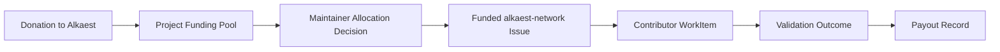

# RFC-0003 — Development Workflow Module

**Status:** Draft
**Author:** modern_alchemist
**Date:** 2026
**Category:** Module Specification

---

# 1. Abstract

This RFC defines the first domain module built on top of the Alkaest protocol: the **Development Workflow Module**.

The module describes how open-source software work is represented and coordinated on the network.
It defines:

* workflow-specific objects
* workflow-specific events
* the lifecycle of a `WorkItem`
* the role of GitHub as an integration surface
* the MVP funding flow for the first self-hosted project

For the MVP, the first project expected to use this module is **Alkaest itself** through the `alkaest-network` project.
Donations to Alkaest are expected to be allocated to `alkaest-network` issues and then distributed to contributors through this workflow.

---

# 2. Goals

This RFC defines:

* the MVP workflow for open-source development coordination
* the first domain-specific object model above RFC-0001
* how issue-based work maps into protocol entities
* how evidence and validation fit into the workflow
* how funding enters the workflow at the issue level

This RFC does not define:

* final escrow mechanics
* final dispute and mediation rules
* full reputation scoring
* canonical encoding or ID derivation rules
* a GitHub-specific protocol

Those concerns belong in later RFCs.

---

# 3. Context

RFC-0001 defines the generic protocol primitives:

* Space
* Membership
* Object
* Event
* Relation
* Message
* Decision
* Envelope

RFC-0002 defines the MVP node architecture and establishes that:

* the MVP is desktop-first
* each developer runs a local full node
* GitHub is an integration layer, not protocol authority
* the first project coordinated through the network is expected to be Alkaest itself

This RFC defines the first practical workflow module that uses those protocol primitives.

---

# 4. MVP Assumptions

To keep the first workflow implementable, this RFC makes the following MVP assumptions.

## 4.1 First project

The first project coordinated through this module is the `alkaest-network` project.

## 4.2 Donation-first funding

Money donated to Alkaest is treated as the first funding source for the network.
That money is allocated into issue-level work items inside the Alkaest project workflow.

## 4.3 Maintainer-directed issue funding

For the MVP, project maintainers decide which issues become funding candidates and how much funding is allocated to them.

## 4.4 Exclusive assignment after acceptance

For the MVP, a funded `WorkItem` is assigned to one contributor at a time after review and acceptance.
Competitive claiming and parallel bounty races are future options, but not required now.

## 4.5 Settlement may remain operationally simple

This RFC allows the workflow to record funding intent, validation outcome, and payout eligibility even if the first settlement implementation is manual or signed-record-based.

---

# 5. Module Scope

The Development Workflow Module is responsible for coordinating:

* issue-based work selection
* assignment
* implementation activity
* evidence submission
* validation
* payout eligibility

It is not responsible for replacing source control, code review, CI, or project hosting platforms.
Instead, it integrates with them while preserving protocol-native records for workflow truth.

---

# 6. Workflow Concepts

The module introduces the following workflow concepts.

## 6.1 Project Space

A software project is represented by a `Space`.

For the MVP, `alkaest-network` is expected to be one such Space.

## 6.2 WorkItem

A `WorkItem` is the primary workflow object representing a unit of software development work.

Typical examples:

* bug fixes
* features
* refactors
* infrastructure tasks
* documentation tasks

## 6.3 Funding Allocation

A Funding Allocation records that project funds have been reserved or intended for a specific `WorkItem`.

In the MVP, Funding Allocation may represent:

* donation-derived issue funding
* sponsor-directed issue funding
* project treasury allocation

## 6.4 Evidence

Evidence is any material used to support the completion or validation of a `WorkItem`.

Examples:

* commits
* pull requests
* CI runs
* test output
* build artifacts
* reviewer notes

## 6.5 Validation Outcome

A Validation Outcome records whether submitted work satisfies the `WorkItem` requirements strongly enough to qualify for acceptance and payout.

---

# 7. Workflow Objects

This module defines the following primary object types.

## 7.1 WorkItem

`WorkItem` is the main domain object.

Recommended object type:

```text
work_item
```

Recommended schema:

```text
alkaest.workflow.work_item.v1
```

Suggested payload:

```text
WorkItem
- title
- description
- projectRef
- externalIssueRef
- status
- complexity
- fundingStatus
- fundingAmount
- assigneeIdentityId
- requestedByIdentityId
- validatorPolicy
- acceptanceCriteria
- deliverableRefs
- evidenceRefs
- createdAt
- updatedAt
```

### Notes

- `externalIssueRef` may point to a GitHub issue.
- `fundingAmount` is informational at the workflow layer until settlement RFCs formalize value transfer.
- `validatorPolicy` may reference project-defined validation expectations.

## 7.2 FundingAllocation

Recommended object type:

```text
funding_allocation
```

Recommended schema:

```text
alkaest.workflow.funding_allocation.v1
```

Suggested payload:

```text
FundingAllocation
- sourceType
- sourceRef
- workItemId
- amount
- currency
- allocatedByIdentityId
- notes
- createdAt
```

### MVP interpretation

For the Alkaest bootstrap workflow, `sourceType` will often represent a donation pool or project treasury decision.

## 7.3 EvidenceRecord

Recommended object type:

```text
evidence
```

Recommended schema:

```text
alkaest.workflow.evidence_record.v1
```

Suggested payload:

```text
EvidenceRecord
- workItemId
- evidenceType
- externalRef
- attachmentRefs
- submittedByIdentityId
- summary
- createdAt
```

## 7.4 ValidationRecord

Recommended object type:

```text
validation_record
```

Recommended schema:

```text
alkaest.workflow.validation_record.v1
```

Suggested payload:

```text
ValidationRecord
- workItemId
- validatorIdentityId
- outcome
- notes
- evidenceRefs
- createdAt
```

## 7.5 PayoutRecord

Recommended object type:

```text
payout_record
```

Recommended schema:

```text
alkaest.workflow.payout_record.v1
```

Suggested payload:

```text
PayoutRecord
- workItemId
- recipientIdentityId
- amount
- currency
- settlementStatus
- settlementRef
- createdAt
```

This object records payout intent or completion even before escrow mechanics are fully specified.

---

# 8. Workflow Events

This module defines the following recommended event types.

```text
work_item.created
work_item.funded
work_item.opened
work_item.claim_requested
work_item.assigned
work_item.started
work_item.evidence_added
work_item.submitted
work_item.validation_recorded
work_item.accepted
work_item.rejected
work_item.payout_authorized
work_item.paid
work_item.closed
work_item.canceled
```

These event names are module conventions built on top of the generic Event model from RFC-0001.

---

# 9. WorkItem Lifecycle

The MVP lifecycle is:

```mermaid
flowchart LR
    ISSUE["Issue Identified"] --> FUND["Funding Allocated"]
    FUND --> OPEN["WorkItem Opened"]
    OPEN --> CLAIM["Claim Requested"]
    CLAIM --> ASSIGN["Assigned"]
    ASSIGN --> BUILD["Work Performed"]
    BUILD --> EVIDENCE["Evidence Submitted"]
    EVIDENCE --> VALIDATE["Validation"]
    VALIDATE --> ACCEPT["Accepted"]
    ACCEPT --> PAY["Payout Authorized"]
    PAY --> CLOSE["Closed"]
```



## 9.1 Issue identified

A project issue exists, either natively in protocol planning or through GitHub integration.

## 9.2 Funding allocated

Project maintainers or authorized actors allocate available funds to the issue.
At that point, the issue becomes a funding candidate for contributor work.

## 9.3 WorkItem opened

A protocol-native `WorkItem` is created for the issue.

## 9.4 Claim requested

A contributor expresses interest in doing the work.

## 9.5 Assigned

A maintainer or authorized actor assigns the `WorkItem` to one contributor for the MVP flow.

## 9.6 Work performed

The assigned contributor performs the work in their normal development tools and repository flow.

## 9.7 Evidence submitted

The contributor or integration adapter submits protocol-visible evidence such as commits, pull requests, CI results, or artifacts.

## 9.8 Validation

Validators or project-authorized reviewers evaluate the evidence and determine whether acceptance criteria are satisfied.

## 9.9 Accepted

The work is accepted as complete for the workflow.

## 9.10 Payout authorized

The workflow records that the contributor is eligible for payment.

## 9.11 Closed

The `WorkItem` is closed once the workflow is complete.

---

# 10. WorkItem Status Model

Recommended statuses:

```text
draft
funded
open
claimed
assigned
in_progress
submitted
accepted
rejected
paid
closed
canceled
```

### MVP rules

- A `WorkItem` SHOULD NOT move to `open` until funding is recorded.
- A `WorkItem` SHOULD have at most one active assignee in the MVP.
- `accepted` means workflow acceptance, not necessarily final reputation issuance.
- `paid` may represent completed payment or a confirmed payout record depending on the settlement layer available.

---

# 11. Funding Flow for the Bootstrap Project

The first practical funding flow is expected to look like this:



## 11.1 Donation intake

Money donated to Alkaest enters a project-controlled funding pool.

## 11.2 Allocation decision

Maintainers decide which `alkaest-network` issues should receive funding and how much should be allocated to each one.

## 11.3 Issue funding

Once funding is attached to an issue, it becomes a candidate `WorkItem`.

## 11.4 Contributor payout path

When work is completed and validated, the workflow creates the records needed to justify payout to the contributor.

This RFC intentionally stops short of defining whether that payout is:

* manual
* signed-record-based
* escrow-backed
* on-chain

That decision belongs to later RFCs.

---

# 12. GitHub Integration Boundary

GitHub is a useful integration surface for the development workflow, but it is not protocol authority.

GitHub integrations MAY provide:

* issue metadata
* labels
* pull request links
* comments
* review states
* CI references

GitHub integrations MUST NOT be treated as the sole source of truth for:

* assignment
* protocol acceptance
* payout authorization
* reputation effects

Those outcomes must still be represented inside Alkaest protocol objects, events, or decisions.

---

# 13. Roles in the Workflow

The MVP workflow assumes the following practical roles.

## 13.1 Maintainer

Responsible for:

* selecting funding candidates
* opening funded `WorkItem`s
* reviewing claim requests
* assigning work
* approving or delegating validation

## 13.2 Contributor

Responsible for:

* claiming work
* implementing the task
* submitting evidence
* responding to review

## 13.3 Validator

Responsible for:

* reviewing evidence
* determining whether acceptance criteria are met
* producing validation records

For the MVP, validator membership may be project-declared.

---

# 14. Project Integration Configuration

Projects using this module will likely need a project-local configuration file.

This RFC expects a future `.alkaest/project.yaml` draft to define fields such as:

* project identity
* repository references
* validator policy
* maintainer identities
* funding policy
* issue eligibility rules
* evidence requirements

That file format is not finalized here, but this RFC establishes the need for it.

---

# 15. Decisions and Constraints

The following constraints are intentional for the MVP:

* the workflow is issue-centric
* assignment is exclusive after acceptance
* funding is maintainers-directed
* GitHub remains an integration surface
* payout eligibility can be represented before escrow is fully specified
* the first reference project is Alkaest itself

These choices optimize for clarity and operational feasibility over maximum market flexibility.

---

# 16. Open Areas for Later RFCs

This RFC leaves the following to later RFCs:

* final settlement mechanics
* automated escrow and bond logic
* full dispute procedures
* reputation issuance rules
* validator selection markets
* non-exclusive bounty competition
* generalized multi-project funding allocation markets

---

# 17. Summary

The Development Workflow Module is the first concrete domain module for Alkaest.
It turns the protocol into a system that can coordinate real open-source work.

For the MVP, the most important outcome is practical and self-hosting:

* Alkaest coordinates the development of Alkaest
* `alkaest-network` issues become the first protocol work items
* donations to Alkaest become issue-level funding inputs
* contributors become the first developers paid through the network

That gives the protocol a real project, a real funding flow, and a real test of whether the architecture is useful.
